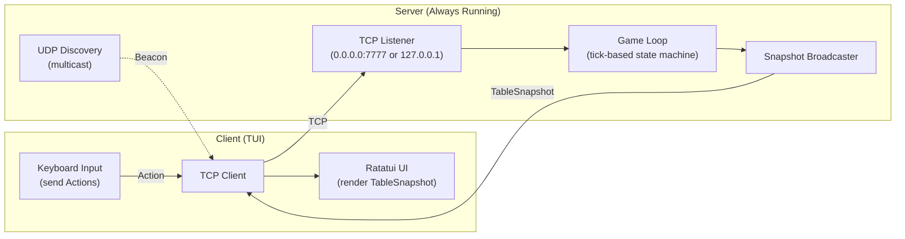
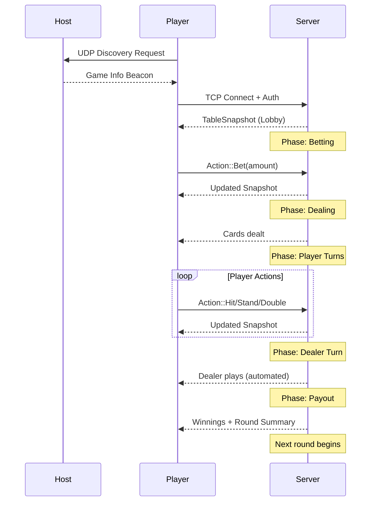

# 🃏 Blackjack
[](https://www.rust-lang.org)
[](LICENSE)
[](https://github.com/AsbestosSoup-dev/blackjack/actions/workflows/ci.yml)
[](#)

A cross-platform, terminal-based multiplayer blackjack game written in **Rust**.  
Play solo, with bots, or over LAN/WAN — all through a clean, responsive text UI.

---

## ✨ Features

### 🎮 Gameplay
- **1–8 player table** (default 1–6)
- **Standard blackjack rules**: 6-deck shoe, dealer stands on soft 17
- **Actions**: Hit, Stand, Double (Splits, Insurance, Side Bets coming soon)
- **Deterministic RNG**: Seeded rounds for fair play
- **Bot players**: Fill empty seats with configurable AI (basic strategy to card counting)

### 💻 Terminal Interface
- **Clean, adaptive TUI** via Ratatui + Crossterm
- **Dealer + player grid layout** with card visualization
- **Action panel**, message log, and audit view
- **Themes**: Default / Dark / High-Contrast
- **Spectator mode** for observers
- **Chat system**: Players and spectators communicate in-game

### 🌐 Networking
- **Always-on server architecture**: Even singleplayer runs a local server
- **Seamless multiplayer**: "Open to LAN/WAN" from any game in progress
- **Auto-discovery**: UDP broadcast finds local games automatically
- **Manual connection**: Direct IP:Port entry for WAN or discovery failures
- **Late joins & reconnections**: Players can join mid-session or recover from disconnects
- **TLS encryption**: Built-in support for secure WAN play

### 🧑‍💼 Admin / Debug Mode
- **Host-only console** accessible in-game
- **Transparent actions**: All admin commands logged and broadcast to players
- **Abilities**:
    - View or shuffle deck
    - Adjust player credits
    - Inject specific cards (testing)
    - Skip phases
    - Simulate network conditions (latency, packet loss)
- **Audit trail**: Every action marked `[ADMIN]` for transparency

### 💾 Persistence
- **Session save/restore**: Host can save game state and resume later
- **Player credits**: Optional persistent balances across sessions
- **Configuration**: Auto-save/load from `~/.config/blackjack/config.toml`
- **Per-player stats**: Track hands won, total wagered (opt-in)

### ⚙️ Cross-Platform
- **Runs on Windows, macOS, and Linux**
- **Portable single binary**
- **Clean terminal restoration** on exit

---

## 🚀 Quick Start

### Prerequisites
- **Rust 1.85+** (Edition 2024)
- Terminal with Unicode support

### Installation

```bash
# Clone the repository
git clone https://github.com/AsbestosSoup-dev/blackjack.git
cd blackjack

# Build release binary
cargo build --release

# Run the game
./target/release/blackjack
```

### First Launch

1. **Splash screen**: Press `SPACE` to continue
2. **Main menu**:
    - **Host Game**: Start a new session (singleplayer or multiplayer)
    - **Join Game**: Connect to an existing game
    - **Settings**: Configure rules, network, display, credits

---

## 🎯 How to Play

### Singleplayer
1. Select **Host Game** from main menu
2. Configure game rules (or use defaults)
3. Game starts with local server on `127.0.0.1` (private)
4. Add bots via settings to fill table

### Multiplayer (LAN)
**Host:**
1. Start game as singleplayer
2. Press `ESC` → **Open to LAN**
3. Server rebinds to `0.0.0.0:7777` and broadcasts discovery
4. Share game name with friends

**Join:**
1. Select **Join Game** from main menu
2. Wait 3 seconds for auto-discovery
3. Select game from list OR enter IP manually
4. Connect and play

### Multiplayer (WAN)
**Host:**
1. Open to LAN, then configure port forwarding (default port `7777`)
2. Share public IP:Port with friends
3. Optionally set password in Settings → Network

**Join:**
1. Select **Join Game** → **Manual IP**
2. Enter `host_ip:7777` and optional password
3. Connect via TLS-encrypted session

---

<details>
<summary><h2>🏗️ Architecture</h2></summary>

### Technology Stack

| Component | Technology | Notes |
|-----------|-----------|-------|
| **Core Logic** | Pure Rust state machine | Phase-based game progression with explicit state transitions |
| **Networking** | `tokio 1.x`, `bincode 2.0` | Async TCP, minimal runtime features |
| **UI** | `ratatui 0.29`, `crossterm` | Cross-platform terminal rendering |
| **Logging** | `tracing 0.1` | Async-native structured logging with spans |
| **Serialization** | `serde`, `bincode`, `toml` | Binary protocol + human-readable config |
| **Security** | `rustls 0.23`, `argon2 0.5`, `hmac` | TLS 1.3, password hashing, session tokens |

### Network Architecture



**Key Design Decisions:**
- **Server-authoritative**: All game logic runs on host, clients are presentation layer
- **Snapshot-based sync**: Full state broadcast each tick (simple, resilient)
- **Always-server model**: Even singleplayer runs local server for uniform architecture
- **UDP discovery**: LAN games auto-detected via multicast beacons
- **TLS by default**: WAN-ready from day one

### Game Loop Tick Cycle

```
1. Receive Network Events (client actions queued)
2. Update Game State (process actions, advance phases)
3. Apply Game Rules (blackjack logic, dealer AI)
4. Build TableSnapshot DTO
5. Broadcast to all connected clients
6. Sleep until next tick (16ms target)
```

### Round Lifecycle



</details>

---

## 🛡️ Security

### LAN Play
- **No encryption**: Plaintext TCP within trusted local network
- **No authentication**: All local clients trusted

### WAN Play
- **TLS 1.3 encryption**: Mandatory via rustls
- **Optional password**: Argon2id hashing (19 MiB memory, 2 iterations)
- **Session tokens**: HMAC-SHA256 for stateless authentication
- **Rate limiting**: Prevents action spam and DoS

### Admin Transparency
- All admin actions logged and broadcast to players
- Audit trail prevents hidden manipulation
- Players can see exact admin commands executed

**Note**: For internet play, recommend SSH tunnel or VPN for additional security layer.

---

## 🧠 Roadmap

| Version | Features |
|---------|----------|
| **v0.1 (Current)** | Core gameplay, singleplayer, basic multiplayer |
| **v0.2** | Splits, insurance, perfect pairs side bet |
| **v0.3** | Advanced bots (card counting), replay system |
| **v0.4** | Session statistics, leaderboards |
| **v1.0** | Full feature set, production polish |

---

## 👨‍💻 Development

### Project Structure

```
src/
├── lib.rs              # Library entry for testing
├── main.rs             # Binary entry point
├── app.rs              # Application orchestration
├── config.rs           # Configuration management
├── error.rs            # Centralized error types
├── logging.rs          # Tracing initialization
├── core/               # Game logic
│   ├── card.rs
│   ├── hand.rs
│   ├── shoe.rs
│   ├── rules.rs
│   └── payout.rs
├── engine/
│   ├── game.rs
│   ├── state.rs
│   ├── bot.rs
│   └── admin.rs
├── net/                # Networking
│   ├── protocol.rs
│   ├── server.rs
│   ├── client.rs
│   ├── session.rs
│   └── discovery.rs
├── tui/                # Terminal UI
│   ├── render.rs
│   ├── input.rs
│   ├── layout.rs
│   └── theme.rs
├── types/              # Shared domain types
│   ├── player.rs
│   ├── phase.rs
│   └── action.rs
└── persist/            # Save/load
    ├── session.rs
    └── stats.rs
```

### Building

```bash
# Development build (optimized for iteration)
cargo build

# Release build (optimized for performance)
cargo build --release

# Run tests
cargo test

# Run with logging
RUST_LOG=blackjack=debug cargo run
```

### Testing

```bash
# Unit tests (inline in source files)
cargo test --lib

# Integration tests
cargo test --test '*'

# Specific module
cargo test core::hand
```

---

## 🐛 Troubleshooting

**Port already in use**
- Change port in Settings → Network
- Default fallback: OS assigns random available port

**Can't discover LAN games**
- Check firewall allows UDP multicast
- Verify same subnet (192.168.x.x or 10.x.x.x)
- Use Manual IP as fallback

**Connection drops during game**
- Server attempts 3 reconnections automatically
- Host can resume session if crash via persistence
- Check network stability (ping host)

**Performance issues**
- Reduce terminal size (smaller render area)
- Disable animations in settings
- Check CPU usage (game should be <5%)

---

## 🧾 License

MIT License - see [LICENSE](LICENSE) file

---

## 📞 Contact

- **GitHub Issues**: Bug reports and feature requests
- **Discussions**: Design feedback and gameplay suggestions