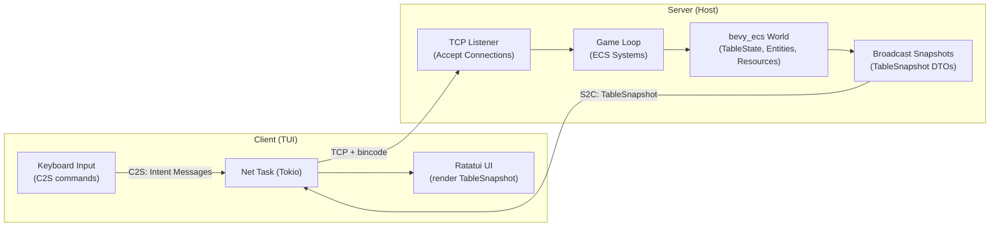
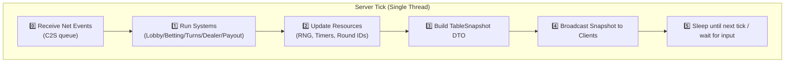
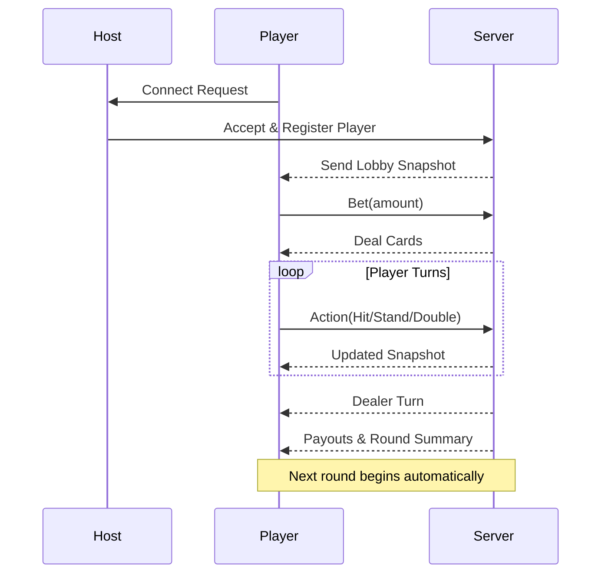

# 🃏 Blackjack

A cross-platform, terminal-based multiplayer blackjack game written in **Rust**.  
Play solo, with bots, or over LAN/WAN — all through a clean, responsive text UI.

---

## ✨ Features

### 🎮 Gameplay
- 1–8 player table (default 1–6)
- Standard blackjack rules (6-deck shoe, dealer stands on soft 17)
- Actions: Hit, Stand, Double (Splits coming soon)
- Deterministic RNG (seeded rounds)
- Full rounds with replay and clear phase transitions

### 💻 TUI Interface
- Clean, adaptive terminal UI (via Ratatui + Crossterm)
- Dealer + player grid layout
- Action panel, message log, and audit view
- Themes: default / dark / high-contrast
- Spectator mode for observers

### 🤖 Bots
- Fill empty seats automatically or manually
- Play using simple “basic strategy”
- Clearly marked bot seats
- Add/remove bots mid-session (admin or pre-session)

### 🌐 Networking
- Host/join games locally or over LAN
- Auto-discovery (UDP beacons)
- Late joins & reconnections supported
- Lightweight async I/O with Tokio
- Optional password-protected sessions

### 🧑‍💼 Admin / Creative Mode
- Host-only console (in-app)
- All admin actions are logged and broadcasted
- Abilities:
  - View or shuffle deck
  - Adjust credits
  - Inject cards (debug)
  - Skip phases
  - Simulate latency or packet loss
- Transparently marked `[ADMIN]` actions

### 💾 Persistence
- Auto-save/load session configuration (`~/.config/blackjack/config.toml`)
- Optional local credits + stats
- Host can enforce persistence or disable it

### ⚙️ Cross-platform
- Runs on Windows, macOS, and Linux
- Portable single binary
- Clean terminal restoration on exit

---

## 🚀 Quick Start
1. **Download or build**
   ```bash
   cargo build --release
   ```
2. **Run the app**
   ```bash
   ./target/release/blackjack
   ```
3. Choose **Host Game** or **Join Game** in the startup menu.

4. (Optional) Open settings to adjust:
   - Seats (1–8)
   - Bets, timeouts, rules
   - Theme and bots
   - Network visibility

---

## 🧩 Architecture
| Component | Tech | Notes |
|------------|------|-------|
| Core Logic | `bevy_ecs` | Phase-based systems, deterministic RNG |
| Networking | `tokio`, `serde`, `bincode` | Async TCP, lock-free |
| UI | `ratatui`, `crossterm` | Cross-platform TUI |
| Config | `toml`, `serde_json` | Auto-load/save |
| Optional Security | `rustls`, `hmac`, `argon2` | TLS + password auth for WAN |

---

## 🕸️ Network Architecture



---

## ⚙️ ECS Tick Cycle



---

## 🔁 Round Lifecycle



---

## 🛡️ Security Notes
- LAN sessions: plaintext (safe for local play)
- WAN sessions: use a tunnel (SSH/ngrok/Cloudflare)
- Optional TLS with Rustls
- All admin actions are visible to all players

---

## 🧠 Roadmap
| Version | Features |
|----------|-----------|
| v1.0 | Multiplayer blackjack, bots, admin, discovery |
| v1.1 | Splits, insurance, replays, mDNS |
| v1.2 | Leaderboards, color-blind UI, mouse input |

---

## 👨‍💻 Development
**Language:** Rust  
**Edition:** 2024  
**Crates:** `tokio`, `bevy_ecs`, `ratatui`, `serde`, `bincode`, `crossterm`, `rustls`, `rcgen`

---

## 🧾 License
MIT License (see `LICENSE` file)

---

## ✍️ Credits
Game design and documentation by AsbestosSoup.  
README documentation created collaboratively with **ChatGPT (OpenAI)**.
